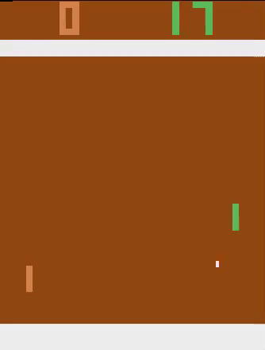
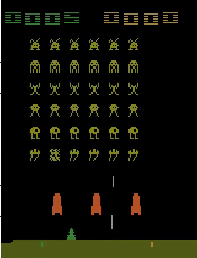

Baby A3C: solving Atari environments in 180 lines
=======
Sam Greydanus | October 2017 | MIT License

Results after training on 40M frames:

Usage
--------

If you're working on OpenAI's [Breakout-v0](https://gym.openai.com/envs/Breakout-v0/) environment:
 * To train: `python baby-a3c.py --env Breakout-v0`
 * To test: `python baby-a3c.py --env Breakout-v0 --test True`
 * To render: `python baby-a3c.py --env Breakout-v0 --render True`

About
--------

_Make things as simple as possible, but not simpler._

Frustrated by the number of deep RL implementations that are clunky and opaque? In this repo, I've stripped a [high-performance A3C model](https://github.com/ikostrikov/pytorch-a3c) down to its bare essentials. Everything you'll need is contained in 180 lines...
	
 * If you are trying to **learn deep RL**, the code is compact, readable, and commented
 * If you want **quick results**, I've included pretrained models
 * If **something goes wrong**, there's not a mountain of code to debug
 * If you want to **try something new**, this is a simple and strong baseline

|			                        | Breakout-v0   | Pong-v0       | SpaceInvaders-v0  |
| -------------                     | :------------:| :------------:| :------------:    |
| *Mean episode rewards @ 40M frames | 62 ± 2     | 20 ± 0.5      | 30 ± 1          |

* these scores improve with further training

Dependencies
--------
 * Python 2.7 or 3.6
 * NumPy
 * SciPy: just on two lines -> workarounds possible
 * [PyTorch](http://pytorch.org/): easier to write, understand, and debug than TensorFlow :)
