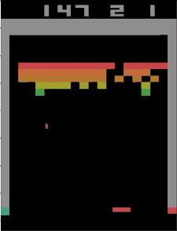

Baby A3C: solving Atari environments in 180 lines
=======
Sam Greydanus | October 2017 | MIT License

Results after training on 40M frames:




Usage
--------

If you're working on OpenAI's [Breakout-v4](https://gym.openai.com/envs/Breakout-v4/) environment:
 * To train: `python baby-a3c.py --env Breakout-v4`
 * To test: `python baby-a3c.py --env Breakout-v4 --test True`
 * To render: `python baby-a3c.py --env Breakout-v4 --render True`

About
--------

_Make things as simple as possible, but not simpler._

Frustrated by the number of deep RL implementations that are clunky and opaque? In this repo, I've stripped a [high-performance A3C model](https://github.com/ikostrikov/pytorch-a3c) down to its bare essentials. Everything you'll need is contained in 180 lines...
	
 * If you are trying to **learn deep RL**, the code is compact, readable, and commented
 * If you want **quick results**, I've included pretrained models
 * If **something goes wrong**, there's not a mountain of code to debug
 * If you want to **try something new**, this is a simple and strong baseline
 * Here's a [quick intro to A3C](https://goo.gl/Ub3vCY) that I wrote

|			                         | Breakout-v4  | Pong-v4       | SpaceInvaders-v4  |
| -------------                      |:------------:| :------------:| :------------:    |
| *Mean episode rewards @ 40M frames | 140 ± 20     | 18.2 ± 1    |   470 ± 30        |
| *Mean episode rewards @ 80M frames | 190 ± 20     | 17.9 ± 1    |   550 ± 30        |

\*same (default) hyperparameters across all environments

Architecture
--------

```python
self.conv1 = nn.Conv2d(channels, 32, 3, stride=2, padding=1)
self.conv2 = nn.Conv2d(32, 32, 3, stride=2, padding=1)
self.conv3 = nn.Conv2d(32, 32, 3, stride=2, padding=1)
self.conv4 = nn.Conv2d(32, 32, 3, stride=2, padding=1)
self.gru = nn.GRUCell(32 * 5 * 5, memsize) # *see below
self.critic_linear, self.actor_linear = nn.Linear(memsize, 1), nn.Linear(memsize, num_actions)
```

\*we use a GRU cell because it has fewer params, uses one memory vector instead of two, and attains the same performance as an LSTM cell.

Environments that work
--------
_(Use `pip freeze` to check your environment settings)_
 * Mac OSX (test mode only) or Linux (train and test)
 * Python 3.6
 * NumPy 1.13.1+
 * Gym 0.9.4+
 * SciPy 0.19.1 (just on two lines -> workarounds possible)
 * [PyTorch 0.4.0](http://pytorch.org/)

Known issues
--------
 * I recently ported this code to Python 3.6 / PyTorch 0.4. If you want to run on Python 2.7 / PyTorch 0.2, then look at one of my earlier commits to this repo (there are different pretrained models as well)